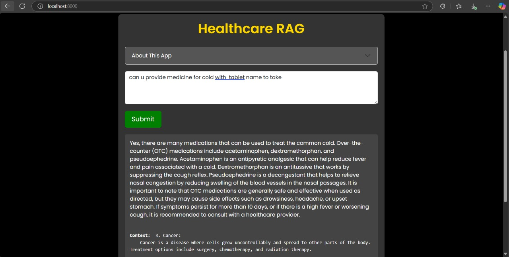

# 🏥 Medical RAG with BioMistral 7B 🩺

Welcome to **Medical RAG**, a Retrieval-Augmented Generation (RAG) system designed specifically for the medical domain! This project leverages the power of **BioMistral 7B**, a specialized large language model, to provide accurate and insightful medical responses. 

## ✨ Features
- **Powered by BioMistral 7B**: A state-of-the-art open-source medical LLM.
- **Self-Hosted Vector Database**: Uses Qdrant to efficiently store and retrieve medical knowledge.
- **Advanced Embeddings**: Integrates **PubMedBert** to enhance search accuracy.
- **Orchestration Framework**: Built with **LangChain** and **Llama CPP** for smooth interactions.
- **User-Friendly Interface**: Easy-to-use UI for querying medical knowledge.

## 📌 What is BioMistral?
BioMistral is a collection of specialized **open-source** medical language models, built on top of the powerful **Mistral LLM** and trained on vast medical datasets, including **PubMed Central**.

### 🔹 Why BioMistral?
✅ **Open-Source** – Free to use under the Apache License 🚀  
✅ **Multiple Model Sizes** – Flexible based on your hardware 💻  
✅ **High Accuracy** – Among the best open-source medical LLMs 📊  
✅ **Versatile Applications** – Useful for:
   - Generating medical reports 📝
   - Answering complex medical queries ❓
   - Assisting in clinical decision-making 🏥
   - Analyzing medical literature 📚
   - Powering AI-driven patient support chatbots 💬

## 🖥️ User Interface


## 🚀 Getting Started
### 1️⃣ Install Dependencies
Make sure **Docker** is installed. Then, set up the **Qdrant** vector database:
```bash
docker pull qdrant/qdrant